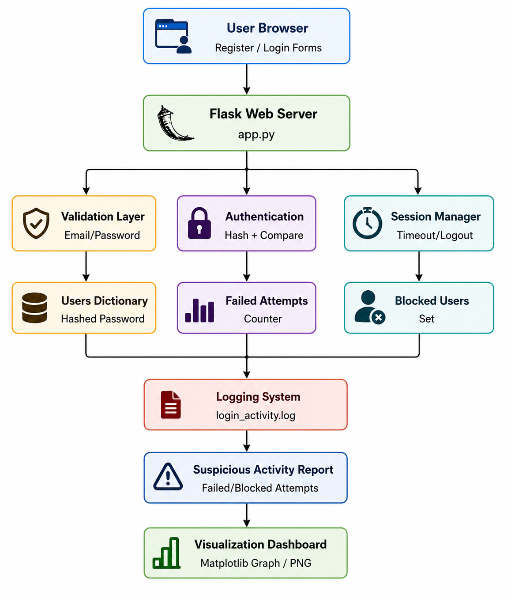
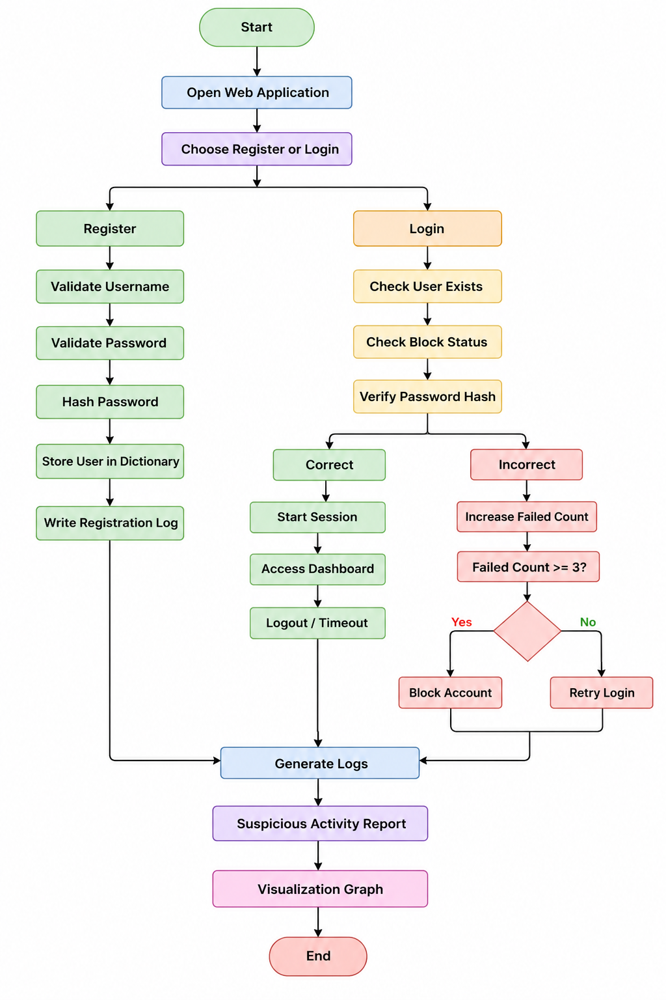

## Secure University Login & Session Monitoring System
```text
A Python Flask-based secure login simulator for a university student portal.
```

---
## Features
```text

- Username format validation
- Password complexity validation
- Password hashing using SHA-256
- Failed login attempt tracking
- Account blocking after 3 failures
- Login activity logging
- Session timeout simulation
- User records using dictionaries
- External log file storage
- Suspicious activity reporting
- Visualization using Matplotlib
- Docker and Docker Compose support

```
---

## Run on Kali Linux

````md


```bash
sudo apt update

sudo apt install python3 python3-pip python3-venv -y

git clone https://github.com/code-with-nc/secure-login-system.git

cd secure-login-system

python3 -m venv venv

source venv/bin/activate

pip install -r requirements.txt

python app.py
````

Open browser:

```text
http://127.0.0.1:5000
```

---

## Run Using Docker

```bash
sudo apt install docker.io docker-compose -y

sudo systemctl start docker

sudo systemctl enable docker

docker compose up --build
```

---

## Stop Docker Container

```bash
docker compose down
```

---

## GitHub Push Commands

```bash
git init

git add .

git commit -m "Initial commit: secure university login system"

git branch -M main

git remote add origin https://github.com/code-with-nc/secure-login-system.git

git push -u origin main
```

---

## Architecture Diagram



---

## Architecture Description

The system follows a client-server architecture where users interact with a Flask-based web interface. The backend validates credentials, hashes passwords using SHA-256, authenticates users, tracks failed login attempts, manages secure sessions, blocks suspicious accounts, stores activity logs in external files, and generates suspicious activity visualization reports using Matplotlib.

---

## Project Structure

```text
secure-login-system/
│
├── app.py
├── requirements.txt
├── Dockerfile
├── docker-compose.yml
├── README.md
│
├── templates/
│   └── index.html
│
├── static/
│   ├── style.css
│   └── suspicious_report.png
│
├── images/
│   ├── architecture.png
│   └── flowchart.png
│
└── logs/
    └── login_activity.log
```

---

## Flowchart



---

## Security Observations

* Passwords are stored in hashed form using SHA-256 instead of plain text.
* Username validation allows only university email format.
* Password complexity validation enforces strong passwords.
* Failed login attempts are tracked to detect brute-force behavior.
* Account is blocked automatically after 3 failed login attempts.
* Session timeout reduces risk of unauthorized access.
* Login activities are stored in an external log file for auditing.
* Suspicious activities are identified from failed, blocked, and unknown login attempts.
* Matplotlib visualization helps analyze suspicious login patterns.
* The system demonstrates secure authentication and session monitoring workflow.

---

## Security Features

* Secure password hashing
* Brute-force attack prevention
* Session timeout mechanism
* Login activity auditing
* Suspicious activity monitoring
* External logging support

---

## Future Enhancements

* Database integration
* bcrypt/Argon2 hashing
* OTP authentication
* Admin dashboard
* JWT authentication
* Cloud deployment
* IP tracking and analytics

```
```
